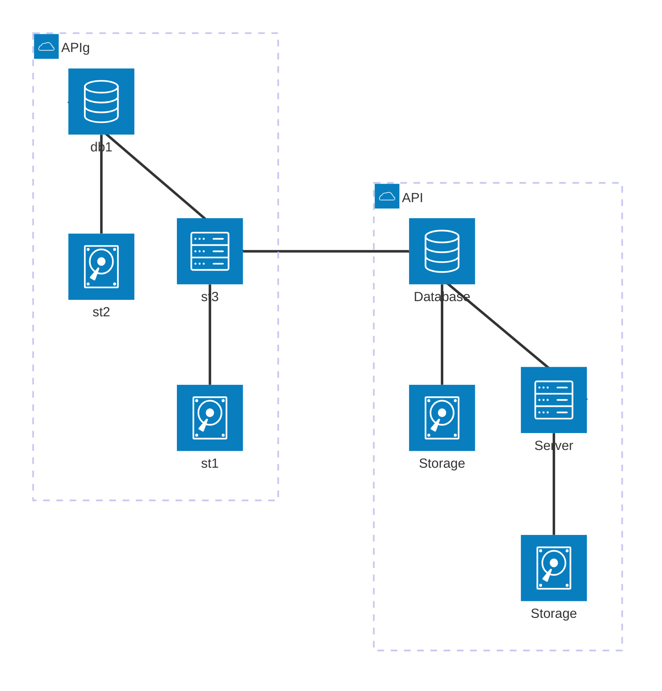

# システム構成

ここにシステム構成を書く。

```dart:main.dart
void main() {
  runApp(const MyApp());
}
```


```mermaid
architecture-beta
    group api(cloud)[API]

    service db(database)[Database] in api
    service disk1(disk)[Storage] in api
    service disk2(disk)[Storage] in api
    service server(server)[Server] in api

    group test(cloud)[APIg]

    service first(database)[db1] in test
    service second(disk)[st1] in test
    service third(disk)[st2] in test
    service four(server)[st3] in test
    
    db:L -- R:server
    disk1:T -- B:server
    disk2:T -- B:db

    first:L -- R:four
    second:T -- B:four
    third:T -- B:first

    db:L -- R:four
```